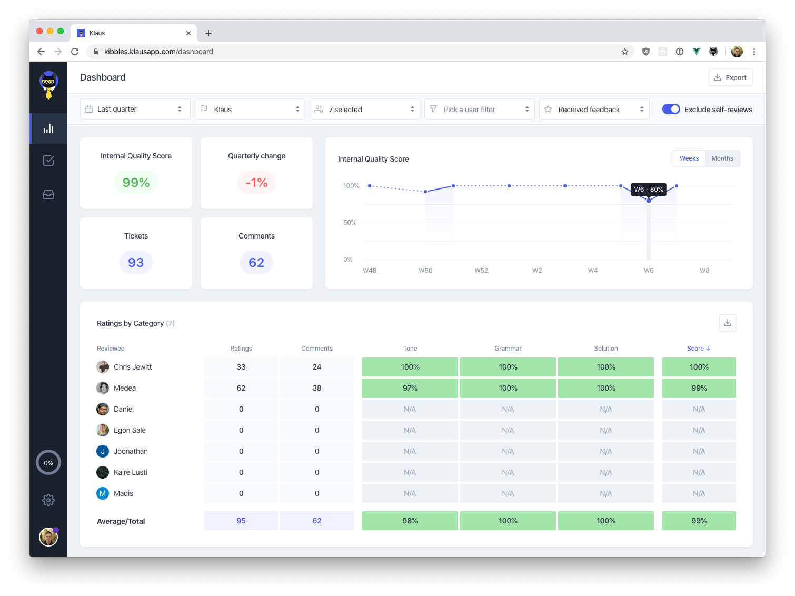

# QA Automation Test Task

As a test task for [Klaus](https://www.klausapp.com) QA Automation position we ask our candidates to write automated E2E test cases for our dashboard view.

You are free to choose your stack and technologies. At Klaus our services are built using [Go](https://golang.org) and Java and our UI stack is built on [Vue.js](https://vuejs.org). We run our software in containers on [Kubernetes](https://kubernetes.io) and make heavy use of [GitHub Actions](https://github.com/features/actions) for our CI/CD needs. For E2E testing we have experience using [Cypress](https://www.cypress.io).

### Guidelines:
* Scope and granularity of the test is up to you — we are more interested in your thought process around your choices rather than broad coverage.
* Choose the most suitable testing stack for the job.
* Test flow should be CI ready or have an implementation plan for it.
* Write rationale for major stack and implementation choices.

**Access credentials for test environment will be sent by email.**
**Fork this repository to store your code and email us the link to your fork.**
